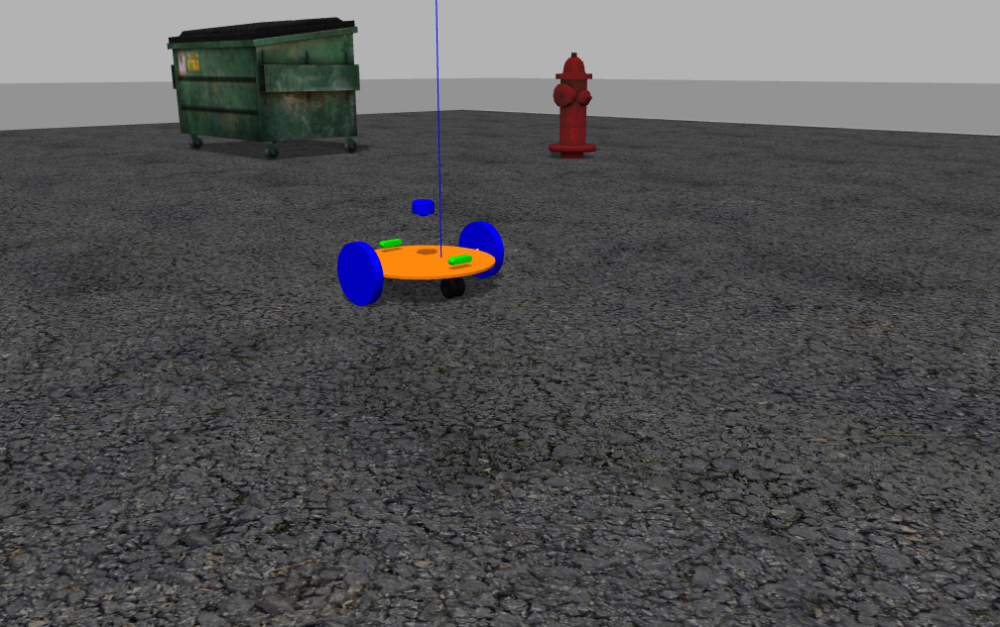

# RobotOne


RobotOne is a robot developed by Valkyrie UAV, based in [GuntherBOT](https://github.com/cesarhcq/abrobot), this robot is created to be simulated in Gazebo and RViz

## Steps to create RobotOne based on ROS and Gazebo

### first step
The first step to create RobotOne is create the description repository, where will be the the launch, meshes and urdf (unified robot description file), in this part will be created the simplest robot, with only base_link and wheels.

### Second step
In this step the robot will become more developed, with cameras and sensors and simulated in RViz.

### RobotOne model is based on GuntherBot with differential drive
All components were created in the XML file with joints, collisions, pose, inertia and visual. The script file can be found here: [RobotOne description](https://github.com/LeonFS-code/robot_one/tree/master/robot_one_description). The files used in the RobotOne simulation are: [RobotOne Xacro](https://github.com/LeonFS-code/robot_one/blob/master/robot_one_description/urdf/robot_one.xacro) and [RobotOne Gazebo](https://github.com/LeonFS-code/robot_one/blob/master/robot_one_description/urdf/robot_one.gazebo).



## Steps clone and simulate this repository


1.Create a ROS Workspace (if you don't have yet)
```
mkdir -p ~/RobotOne_ws/src
cd RobotOne_ws
catkin init
cd src
git clone https://github.com/LeonFS-code/robot_one.git
cd RobotOne_ws
catkin_make
```

2.Start a simualtion

```
cd RobotOne_ws
source devel/setup.bash
roslaunch robot_one_gazebo robot_one_g1.launch
rosrun rviz rviz 
```

3.Simulation in RViz

```
-To input wheels and baselink's axle click in "Add" and select "TF", in the "by display type"
-To input odometry, click "Add" and select "Odometry", in the "by topic" part
-To input laser click in "Add" and select "Image", in the "by topic" part
-To input camera click in "aAd" and select "LaserScan"
```